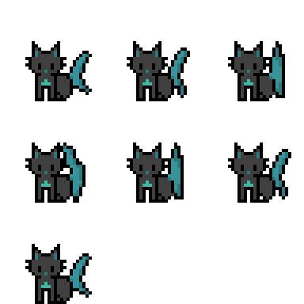

#Animal Alchemy 

> **Short Pitch**: A
> The gods are forging a new world, but they need your help! As their favourite angel, you are sent to Earth on a sacred mission. Create new creatures by combining the animals that already roam the land. Discover, experiment, and fill the grand archive with every possible species. Only then can you return home. Hurry and prove your worth to the gods!

---

## 🌐 **Play the Game**
[Click here to play the game!](https://your-github-username.github.io/repository-name)

---

## 📸 **Screenshots**

### Main Gameplay:

  
  
*Figure 1: Example of gameplay in action.*

---

### Menu and UI:

  
  
*Figure 2: Startscreen*

  
  
*Figure 3: Endscreen with retry button*

  
  
*Figure 4: Archive to look up the base/mixed animals*

---

## 🎨 **Spritesheets**
Below are the sprites used to create characters and objects in the game:

### Player Character:

  
  
*Figure 5: Player character animations.*

  
*In the game it is not that blurred *

---

### Animals:

  
  
*Figure 6: Chicken*

  
  
*Figure 7: Black cat called Ferrox.*

  
  
*Figure 8: Fish.*

  
  
*Figure 9: Tortoiseshell cat called Spooky*

---
### Mixed Animals:

  
  
*Figure 10: caish, fiat or cat-fish*

  
  
*Figure 11: Cacken, Chit, or chicken-cat*

  
  
*Figure 12: fishen (lol), chish or fish-chicken*

---
## ✍️ **Reflection**

### What went well:
- Bringing my idea to the real world and implementing many (for me) very complicated functions
- recreating all the pixel art after losing everything (and it still looks good)

### Challenges:
- overestimating my skill and therefore having to cut out many features I planned to incorporate (of course also due to the short time period)
- linking images and everything else correctly. also getting my ideas of functions to actually work
- asking for help and not feeling bad about it, at first I was extremely hesitant to ask for help, but my friends convinced me and it made everything easier

### Lessons Learned:
- do not always choose the "cool" idea over the simple one (You are making your own life harder)
- You still have to challenge yourself, because if not you can not learn from the experience (I am happy that I chose the "cool" but complicated idea)
